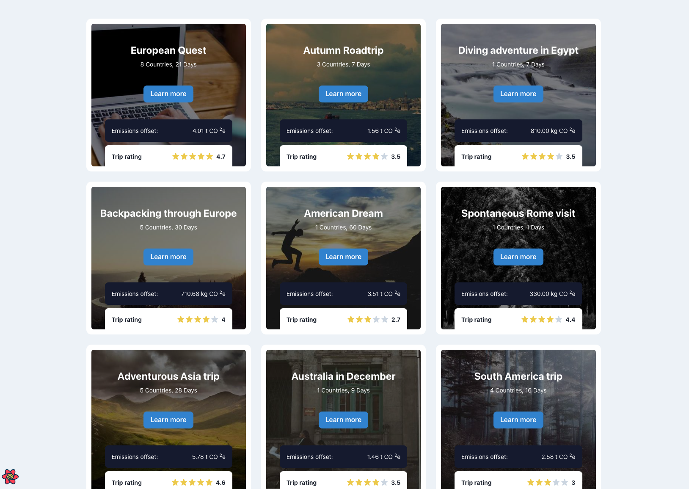
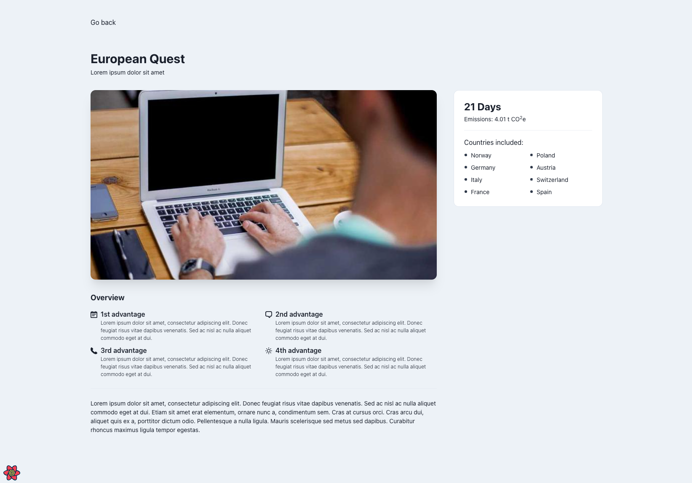

# Trip planner

- [Trip planner](#trip-planner)
  - [Description](#description)
  - [Scope of work](#scope-of-work)
  - [Technologies Used](#technologies-used)
  - [Installation](#installation)
  - [Screenshots](#screenshots)


## Description

This project is a responsive web application built with ReactJS functional components and Typescript. It uses ChakraUI for UI components, fetches data asynchronously from a mock server serving JSON files, and implements infinite scrolling for loading new cards as the user scrolls. Data from the server is cached and preserved between pages. Additionally, there's a feature to pull details of a trip from a separate single-trip endpoint.

## Scope of work

- [x] Chakra UI should be used for UI components.
- [x] Data should be downloaded asynchronously from a mock server that serves JSON files.
- [x] Details of a trip should be pulled from a separate single-trip endpoint.
- [x] New cards should be loaded on page scroll (infinite scrolling).
- [x] Data from the server should be cached and preserved between pages.
- [x] The code should be placed in a repository along with instructions on how to run the project.

## Technologies Used
- React
- Typescript
- ChakraUI

## Installation

1. Clone the repository.
   ```bash
   git clone https://github.com/ruijadom/trip-planner.git
   cd trip-planner

2. Install dependencies.
   ```bash
   npm install
   ```

3. Start the development server.

    This command starts the mock server and the client app concurrently.


   ```bash
    npm run dev
    ```
4. Open [http://localhost:3000](http://localhost:3000) with your browser to see the result.


## Screenshots

Trips view



Trip details view



